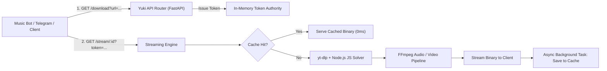

<div align="center">


# ⚡ 𝗬𝗨𝗞𝗜 𝗬𝗧 𝗔𝗣𝗜 𝗦𝗘𝗥𝗩𝗘𝗥

### 🚀 𝗨𝗹𝘁𝗿𝗮-𝗙𝗮𝘀𝘁 𝗬𝗼𝘂𝗧𝘂𝗯𝗲 𝗦𝘁𝗿𝗲𝗮𝗺𝗶𝗻𝗴 & 𝗔𝘂𝗱𝗶𝗼 𝗘𝘅𝘁𝗿𝗮𝗰𝘁𝗶𝗼𝗻 𝗠𝗶𝗰𝗿𝗼𝘀𝗲𝗿𝘃𝗶𝗰𝗲

<p>
  
</p>

<p>
  <a href="https://github.com/SUDEEPBOTS/YUKIYTAPI/stargazers"></a>
  <a href="https://github.com/SUDEEPBOTS/YUKIYTAPI/network/members"></a>
  <a href="https://github.com/SUDEEPBOTS/YUKIYTAPI/issues"></a>
  <a href="https://github.com/SUDEEPBOTS/YUKIYTAPI/actions/workflows/ci.yml"></a>
</p>

<p>
  
  
  
  
  
</p>

---


</div>

## 🎯 𝗪𝗵𝗮𝘁 𝗶𝘀 𝗬𝗨𝗞𝗜 𝗬𝗧 𝗔𝗣𝗜?

**𝗬𝗨𝗞𝗜 𝗬𝗧 𝗔𝗣𝗜** is an enterprise-grade, high-performance media extraction microservice engineered for music bots, Telegram bots, and web applications. Powered by **FastAPI** and the latest **yt-dlp** engine with YouTube JavaScript Challenge bypassing, it delivers ultra-low latency audio/video streaming with intelligent local disk vault caching.

Eliminate reliance on slow external third-party extractors. Host your own media engine directly on your VPS with zero latency and complete privacy.

⚡ **Sub-Second Response Times** &bull; 💾 **Smart Disk Vault Caching** &bull; 🛡️ **Challenge Bypass Ready**

<div align="center">

</div>

## 🏗️ 𝗦𝘆𝘀𝘁𝗲𝗺 𝗔𝗿𝗰𝗵𝗶𝘁𝗲𝗰𝘁𝘂𝗿𝗲



<div align="center">

</div>

## ✨ 𝗙𝗲𝗮𝘁𝘂𝗿𝗲𝘀

<table>
<tr>
<td>

### ⚡ 𝗟𝗶𝗴𝗵𝘁𝗻𝗶𝗻𝗴 𝗦𝗽𝗲𝗲𝗱 & 𝗟𝗼𝗰𝗮𝗹 𝗧𝗿𝗮𝗻𝘀𝗳𝗲𝗿
- Ultra-low latency response times (<1s)
- Direct socket transfer speeds up to 400+ MB/s on localhost
- Asynchronous non-blocking streaming via FastAPI & Uvicorn
- Seamless integration with Pyrogram / Telethon music bots

</td>
<td>

### 🛡️ 𝗬𝗼𝘂𝗧𝘂𝗯𝗲 𝗦𝗲𝗰𝘂𝗿𝗶𝘁𝘆 𝗕𝘆𝗽𝗮𝘀𝘀
- Integrated Node.js runtime for Proof-of-Work JS challenges
- `ejs:github` remote challenge solver components
- Support for Netscape-format `cookies.txt`
- Graceful fallbacks for age-restricted or rate-limited streams

</td>
</tr>
<tr>
<td>

### 💾 𝗦𝗺𝗮𝗿𝘁 𝗗𝗶𝘀𝗸 𝗩𝗮𝘂𝗹𝘁 𝗖𝗮𝗰𝗵𝗶𝗻𝗴
- Instant hit retrieval for previously requested tracks
- Background thread file promotions to avoid streaming delays
- Live cache size monitoring in MB via `/stats`
- Automatic disk cleanup and storage quotas

</td>
<td>

### 💻 𝗜𝗻𝘁𝗲𝗿𝗮𝗰𝘁𝗶𝘃𝗲 𝗪𝗲𝗯 𝗦𝘁𝘂𝗱𝗶𝗼
- Modern Cyberpunk inspection console (`index.html` & `/web`)
- Real-time token generator and live playback deck
- Integrated HTML5 audio/video player for direct testing
- Live engine telemetry counters and API cheatsheet

</td>
</tr>
</table>

<div align="center">

</div>

## 📡 𝗔𝗣𝗜 𝗘𝗻𝗱𝗽𝗼𝗶𝗻𝘁𝘀

| Method | Endpoint | Description | Auth |
| :--- | :--- | :--- | :--- |
| `GET` | `/` | Root service descriptor and available routes | Public |
| `GET` | `/health` | Uptime probe and system health status | Public |
| `GET` | `/web` | Interactive Cyberpunk Web Studio Console | Public |
| `GET` | `/stats` | Telemetry: total downloads, cache size, active tokens | Public |
| `GET` | `/download` | Generate single-use signed download token | Query `url` |
| `GET` | `/stream/{video_id}` | Stream media binary directly with background caching | Token |
| `GET` | `/docs` | Interactive Swagger OpenAPI documentation | Public |

### 1️⃣ Step 1: Generate Download Token

```bash
curl -X GET "http://localhost:8000/download?url=https://www.youtube.com/watch?v=dQw4w9WgXcQ&type=audio"
```

**Response:**
```json
{
  "status": "success",
  "video_id": "dQw4w9WgXcQ",
  "download_token": "YUKIMusic3f9a7c2e8b1d40a1SudeepBots",
  "stream_url": "/stream/dQw4w9WgXcQ?type=audio&token=YUKIMusic3f9a7c2e8b1d40a1SudeepBots",
  "usage": "Use token parameter or X-Download-Token header in /stream endpoint"
}
```

### 2️⃣ Step 2: Stream Media

```bash
curl -L "http://localhost:8000/stream/dQw4w9WgXcQ?token=YUKIMusic3f9a7c2e8b1d40a1SudeepBots&type=audio" -o track.m4a
```

*Or pass the token via Header:*
```bash
curl -L "http://localhost:8000/stream/dQw4w9WgXcQ?type=audio" \
     -H "X-Download-Token: YUKIMusic3f9a7c2e8b1d40a1SudeepBots" -o track.m4a
```

<div align="center">

</div>

## 🤖 𝗠𝘂𝘀𝗶𝗰 𝗕𝗼𝘁 𝗜𝗻𝘁𝗲𝗴𝗿𝗮𝘁𝗶𝗼𝗻

To integrate Yuki YT API with your music bot (such as AniyaMusic, SimmyMusic, or PulseMusic), update your YouTube extractor fallback in your bot's `youtube.py`:

```python
FALLBACK_API_URL = "http://127.0.0.1:8000"

async def get_stream_from_api(video_id: str, is_audio: bool = True):
    media_type = "audio" if is_audio else "video"
    async with aiohttp.ClientSession() as session:
        # 1. Fetch token
        async with session.get(f"{FALLBACK_API_URL}/download?url={video_id}&type={media_type}") as resp:
            data = await resp.json()
            token = data["download_token"]
            
        # 2. Return direct stream URL
        return f"{FALLBACK_API_URL}/stream/{video_id}?type={media_type}&token={token}"
```

<div align="center">

</div>

## 🚀 𝗤𝘂𝗶𝗰𝗸 𝗦𝘁𝗮𝗿𝘁 & 𝗗𝗲𝗽𝗹𝗼𝘆𝗺𝗲𝗻𝘁

### 🐳 𝗢𝗽𝘁𝗶𝗼𝗻 𝟭: 𝗗𝗼𝗰𝗸𝗲𝗿 𝗖𝗼𝗺𝗽𝗼𝘀𝗲 (𝗥𝗲𝗰𝗼𝗺𝗺𝗲𝗻𝗱𝗲𝗱)

```bash
# Clone the repository
git clone https://github.com/SUDEEPBOTS/YUKIYTAPI.git
cd YUKIYTAPI

# Optional: Add your cookies.txt
cp sample_cookies.txt cookies.txt

# Run container
docker compose up -d --build
```

### ⚡ 𝗢𝗽𝘁𝗶𝗼𝗻 𝟮: 𝗟𝗼𝗰𝗮𝗹 𝗩𝗣𝗦 / 𝗦𝗲𝗿𝘃𝗲𝗿 𝗦𝗲𝘁𝘂𝗽

```bash
# 1️⃣ Install system packages
sudo apt update && sudo apt install -y python3 python3-pip python3-venv ffmpeg nodejs npm

# 2️⃣ Clone repository
git clone https://github.com/SUDEEPBOTS/YUKIYTAPI.git
cd YUKIYTAPI

# 3️⃣ Create virtual environment
python3 -m venv venv
source venv/bin/activate

# 4️⃣ Install dependencies
pip install -r requirements.txt

# 5️⃣ Start the API
bash start
```

### 🍪 𝗖𝗼𝗼𝗸𝗶𝗲 𝗖𝗼𝗻𝗳𝗶𝗴𝘂𝗿𝗮𝘁𝗶𝗼𝗻 (𝗢𝗽𝘁𝗶𝗼𝗻𝗮𝗹)

For high-volume production deployments or age-gated music tracks:
1. Export Netscape formatted cookies from your browser using Cookie-Editor.
2. Save the file as `cookies.txt` in the root folder.
3. The API will automatically detect and load `cookies.txt` without needing a restart.

<div align="center">

</div>

## 📜 𝗟𝗶𝗰𝗲𝗻𝘀𝗲

Distributed under the MIT License. See [LICENSE](LICENSE) for more information.

---

<div align="center">

### ⭐ 𝗦𝘁𝗮𝗿 𝘁𝗵𝗶𝘀 𝗿𝗲𝗽𝗼 𝗶𝗳 𝘆𝗼𝘂 𝗳𝗼𝘂𝗻𝗱 𝗶𝘁 𝘂𝘀𝗲𝗳𝘂𝗹!

<p>
  
</p>

<a href="https://github.com/SUDEEPBOTS">
  
</a>
<a href="https://t.me/SUDEEPBOTS">
  
</a>

</div>
